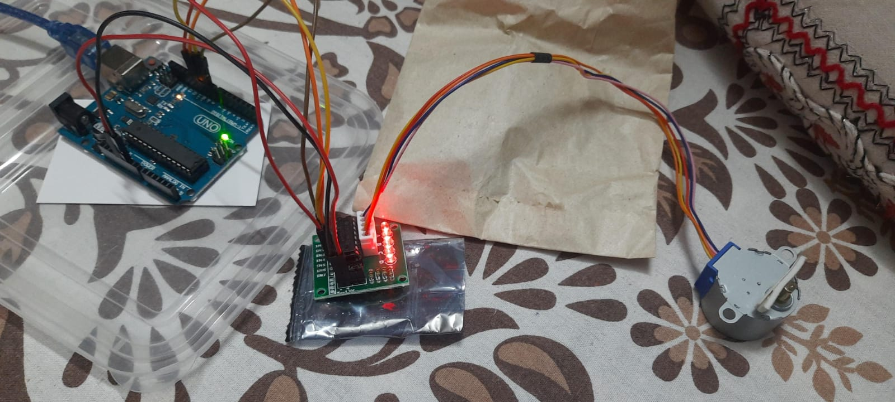

# Setup Stepper Motor with Arduino

### Here by Using Arduino-UNO, ULN2003 Driver motor & Stepper Motor we can do simple functions with motor like rotate it in one direction & rotate in 2 direction with half cycle.

## Working Circuit :

## Wire Connection :

<ul>
<li>IN1-9</li>
<li>IN2-10</li>
<li>IN3-11</li>
<li>IN4-12</li>
<li> Blue wire of stepper Motor in A & rest as follows</li>

</ul>

## Components Required :

<ul>
<li>Arduino-UNO</li>
<li>ULN2003 Driver motor</li>
<li>Stepper Motor</li>
<li> Jumper Wire (Male-Female)</li>
<li> USB Cabel </li>
</ul>

# Setup Servo Motor with Arduino

### Here by Using Arduino-UNO,Servo Motor & Potentiometer we can do simple functions with motor like rotate it from 0 to 27 to & fro with our desired speed as we set from potentiometer .

## Working Circuit :

## Wire Connection :

<ul>
<li>Servo_motor_Orange_color_wire-9</li>
<li>Servo_motor_Brown_color_wire-GND</li>
<li>Servo_motor_Red_color_wire-VCC</li>
<li>Potentiometer_Middle_Pin-A0</li>
<li>Potentiometer_Left_Pin-VCC</li>
<li>Potentiometer_Right_Pin-GND</li>

</ul>

## Components Required :

<ul>
<li>Arduino-UNO</li>
<li>Servo Motor</li>
<li>Potentiometer</li>
<li> Jumper Wire (Male-Female & Male-Male)</li>
<li> USB Cabel </li>
</ul>