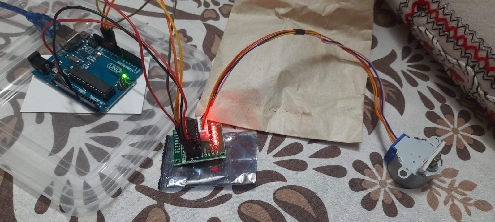

# Setup Stepper Motor with Arduino

### Here by Using Arduino-UNO, ULN2003 Driver motor & Stepper Motor we can do simple functions with motor like rotate it in one direction & rotate in 2 direction with half cycle.

## Working Circuit :

## Wire Connection :

<ul>
<li>IN1-9</li>
<li>IN2-10</li>
<li>IN3-11</li>
<li>IN4-12</li>
<li> Blue wire of stepper Motor in A & rest as follows</li>

</ul>

## Components Required :

<ul>
<li>Arduino-UNO</li>
<li>ULN2003 Driver motor</li>
<li>Stepper Motor</li>
<li> Jumper Wire (Male-Female)</li>
<li> USB Cabel </li>
</ul>

# See the Working Video

[Bidirectional Video](https://youtube.com/shorts/Uwmggl_WnNQ?feature=share)

[Unidirectional Video](https://youtube.com/shorts/x2EdMbb_PLo?feature=share)
